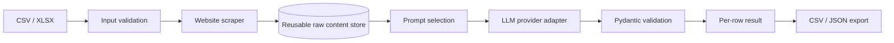

# AI Company Evaluation Pipeline

Small clean-room portfolio project that separates **website collection** from **AI evaluation** so the same scraped content can be reused across multiple customer-specific prompt configurations.

The repository is intentionally narrow. It is a CLI/data-pipeline demo, not a SaaS product.

## What it demonstrates

- Python data processing
- CSV/XLSX input
- lightweight website text extraction
- reusable raw-content cache
- configurable prompt files outside application code
- provider abstraction with deterministic mock mode
- OpenAI and Anthropic adapters
- Pydantic output validation
- bounded retries and timeouts
- row-level failure isolation
- CSV and JSON result export
- tests without paid API credentials
- clean handover documentation

## Architecture



The important design choice is the split between **scraping** and **evaluation**. Raw website text is stored once and can be evaluated repeatedly with different prompt files without scraping again.

## Quick start

```bash
python -m venv .venv
source .venv/bin/activate
pip install -e ".[dev]"
pytest
```

Run the deterministic, fully offline demo using the included cached website fixtures:

```bash
company-eval evaluate \
  --input examples/companies.csv \
  --project company_evaluation \
  --provider mock \
  --raw-dir examples/raw \
  --output-dir out
```

The tests and offline mock demo require no API key and no network access.

## Commands

### 1. Scrape only

```bash
company-eval scrape \
  --input examples/companies.csv \
  --raw-dir data/raw
```

This stores normalized website content under `data/raw/`.

### 2. Evaluate cached content

```bash
company-eval evaluate \
  --input examples/companies.csv \
  --project company_evaluation \
  --provider mock \
  --raw-dir data/raw \
  --output-dir out
```

### 3. Scrape + evaluate

```bash
company-eval run \
  --input examples/companies.csv \
  --project company_evaluation \
  --provider mock \
  --output-dir out
```

## Prompt configuration

Each customer/project prompt is a plain text file:

```text
prompts/company_evaluation.txt
prompts/customer_a.txt
prompts/customer_b.txt
```

To add a new evaluation project, copy a prompt file, edit the text, and pass the filename stem with `--project`. No code change is required.

## Live provider example

Install an optional provider extra and set the API key via environment variable:

```bash
pip install -e ".[openai]"
export OPENAI_API_KEY="..."
company-eval evaluate \
  --input examples/companies.csv \
  --project company_evaluation \
  --provider openai \
  --model gpt-5.6-luna
```

Anthropic is available with `pip install -e ".[anthropic]"` and `ANTHROPIC_API_KEY`.

API credentials are never written to the raw content store or output files.

## Output schema

Every input row produces one output row, even if the website or model call fails.

Core fields:

- `company_name`
- `website`
- `project`
- `status`
- `score`
- `recommendation`
- `cache_hit`
- `error`

A failed address does not terminate the whole batch.

## Scope boundaries

This demo deliberately does not include:

- login-protected scraping
- browser automation for JavaScript-heavy sites
- scheduling
- CRM integration
- web UI
- large-scale crawling
- agent frameworks

Those are separate product decisions, not hidden inside a small pilot.

## Responsible scraping note

Use this only on sites you are permitted to access. Respect applicable terms, robots policies, privacy requirements, and reasonable request rates. This demo uses a descriptive User-Agent and a small page cap.

## Repository purpose

This project is a clean-room portfolio asset built from generic requirements. It contains no employer, client, private-project, trading-strategy, or proprietary source code.
