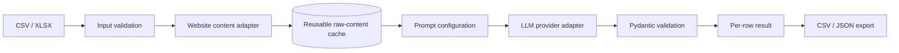

# AI Company Evaluation Pipeline

[](https://github.com/luh0pump/ai-company-evaluation-pipeline/actions/workflows/tests.yml)

A compact, production-minded Python reference for turning company lists and website content into **validated, structured LLM evaluations**.

The project is deliberately narrow: it demonstrates the engineering patterns behind a real automation pilot without pretending to be a full SaaS product.

## Why this exists

A common business workflow looks like this:

1. receive a CSV/XLSX list of companies,
2. collect relevant website content,
3. evaluate each company against a reusable prompt,
4. validate the AI output,
5. export results for downstream sales or research workflows.

The interesting part is not the API call itself. The engineering value is in **repeatability, validation, failure isolation, reusable content, provider abstraction and clean handover**.

## Architecture



### Design principles

- **Collect once, evaluate many times**  
  Website content is cached independently from customer-specific prompts.

- **Configuration over code changes**  
  Evaluation prompts live under `prompts/`.

- **Structured output over free-form text**  
  Provider results must satisfy a Pydantic schema before they are accepted.

- **Row-level failure isolation**  
  One failed website or model response does not terminate the batch.

- **Provider abstraction**  
  Deterministic mock mode plus OpenAI and Anthropic adapters.

- **Zero-cost test path**  
  The test suite and offline demo require no API credentials.

- **Secrets stay outside the repository**  
  API keys are read from environment variables only.

## Quick start

```bash
python -m venv .venv
source .venv/bin/activate
pip install -e ".[dev]"
pytest
```

Run the deterministic offline demo:

```bash
company-eval demo \
  --input examples/companies.csv \
  --project company_evaluation \
  --output-dir out
```

This produces CSV and JSON results without network access or paid API calls.

## Real website + provider run

Mock provider:

```bash
company-eval run \
  --input examples/companies.csv \
  --project company_evaluation \
  --provider mock \
  --output-dir out
```

OpenAI:

```bash
pip install -e ".[openai]"
export OPENAI_API_KEY="..."
company-eval run \
  --input examples/companies.csv \
  --project company_evaluation \
  --provider openai \
  --model gpt-5.6-luna \
  --output-dir out
```

Anthropic is available through the `anthropic` optional dependency and `ANTHROPIC_API_KEY`.

## Prompt configuration

Customer-specific evaluation logic is kept outside the application code.

```text
prompts/
└── company_evaluation.txt
```

A new evaluation project can use a new prompt file without changing the pipeline implementation.

## Output semantics

Each input row produces one result row.

Possible states:

- `SUCCESS`
- `SCRAPE_ERROR`
- `CACHE_MISS`
- `EVALUATION_ERROR`

Core output fields include:

- company name
- website
- project
- status
- score
- recommendation
- rationale
- cache-hit flag
- error detail

## Repository structure

```text
.github/workflows/     CI
docs/                  architecture notes
examples/              synthetic input
prompts/               configurable evaluation prompts
src/ai_company_eval/   implementation
tests/                 deterministic tests
```

## Scope boundaries

This reference intentionally excludes:

- login-protected scraping
- browser automation for JavaScript-heavy applications
- large-scale crawling
- CRM integration
- scheduling
- web UI
- agent frameworks

Those are separate implementation decisions and should be added only when a real business process requires them.

## Responsible use

Only collect content you are permitted to access. Respect applicable terms, privacy requirements, robots policies and reasonable request rates.

## Portfolio note

This repository is a **clean-room technical portfolio asset** built from generic requirements. It contains no employer, client, private-project, trading-strategy or proprietary source code.
