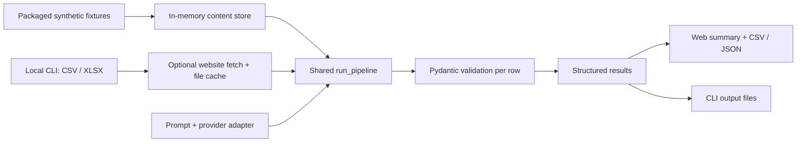

# AI Company Evaluation Pipeline

[](https://github.com/luh0pump/ai-company-evaluation-pipeline/actions/workflows/tests.yml)

A compact Python pipeline and FastAPI web demo for turning company metadata and reusable website content into validated, structured evaluations.

## What this demonstrates

Company input → reusable content → configurable evaluation → schema validation → isolated row results → CSV / JSON.

The engineering focus is repeatability, provider abstraction, content reuse and useful failure handling. This is a clean-room portfolio reference, with no client claims or production SaaS claim.

## Web Demo

**Live portfolio demo:** https://ai-company-evaluation-pipeline.onrender.com

The dark, compact interface includes a read-only prompt preview, calculated run summaries, a result table, company details and downloadable CSV / JSON. Select **Run Evaluation** to execute the existing pipeline against packaged synthetic content.

Every run contains **8 fictional companies: 7 successful evaluations and 1 intentional `CACHE_MISS`**. That fixture has no cached content, so the pipeline truthfully skips evaluation. Scores are illustrative deterministic mock output, not a real sales assessment. Results repeat; measured runtime varies.

- `GET /` — interactive interface
- `GET /health` — cheap JSON status and application mode
- `POST /api/demo/run` — fixed synthetic dataset, no body or query parameters

Exports contain the complete current run rows, including input notes, full recommendations, rationale, processing status, validation status, cache status and errors.

## Portfolio Demo vs Local/Self-hosted

| Capability | Portfolio web (default) | Local CLI |
| --- | --- | --- |
| Synthetic evaluation | Deterministic, 8 fixtures | `company-eval demo` uses the existing example input |
| Content cache | In memory, discarded after each request | Reusable files in the configured raw directory |
| CSV / XLSX input | Fixed packaged dataset; no uploads | `company-eval run --input ...` |
| Prompt | Read-only packaged preview | Editable files selected with `--project` / `--prompt-dir` |
| Website requests | No fetcher constructed or passed | Requires `APP_MODE=local` and `ALLOW_LIVE_FETCH=true` |
| OpenAI / Anthropic | Disabled; neither is instantiated | Requires local mode, `ALLOW_LIVE_PROVIDERS=true`, credentials and model |
| Results | Browser memory and explicit downloads | Files in the configured output directory |

`APP_MODE` accepts `portfolio` or `local` and defaults to `portfolio`. Both live flags default to `false` and accept only `true` / `false`. Portfolio mode overrides the effect of live flags. **In V1 the web interface remains an offline fixture demo even in local mode.** Live capabilities are CLI-only; arbitrary web upload and editable web prompts are intentionally not implemented.

## Local quick start

Python **3.11+** is required.

```bash
python3 -m venv .venv
source .venv/bin/activate
python -m pip install -e ".[dev,web]"
company-eval web
```

Open [the local demo](http://127.0.0.1:8000). The CLI binds to `127.0.0.1:8000` by default; override with `--host` / `--port`. Stop with Ctrl+C. No credentials, database, paid service or internet connection is needed to run the installed demo.

The existing offline CLI also remains available:

```bash
company-eval demo --input examples/companies.csv --project company_evaluation --output-dir out
```

For an explicitly enabled local website run with mock evaluation:

```bash
APP_MODE=local ALLOW_LIVE_FETCH=true company-eval run \
  --input examples/companies.csv --project company_evaluation --provider mock
```

Only fetch sites you are permitted to access. With fetching disabled, `run` uses existing cached content and returns `CACHE_MISS` for missing pages. The local CLI persists content/results to its configured directories; the web demo does not.

To use a live provider, install the corresponding extra (`.[openai]` or `.[anthropic]`), set `APP_MODE=local`, `ALLOW_LIVE_PROVIDERS=true`, and supply `OPENAI_API_KEY` or `ANTHROPIC_API_KEY` through your environment. Select `--provider openai` or `--provider anthropic`. Choose a model through `--model` (takes precedence), `OPENAI_MODEL`, or `ANTHROPIC_MODEL`. There is no hardcoded model and no silent fallback to mock. Fetching requires its own separate flag. Live provider execution can incur API charges.

`.env.example` documents supported settings; the app does not automatically load a dotenv file. Never commit credentials. The CLI's existing examples and prompt defaults are relative to the working directory; pass explicit paths when launching those commands elsewhere.

## Architecture



`core.py` owns execution, `models.py` owns schemas, and `providers.py` provides mock/OpenAI/Anthropic adapters. `config.py` enforces explicit live enablement. `portfolio.py` supplies the in-memory adapter and computes summaries/exports from real rows. `web.py` provides the stateless HTTP surface. Jinja templates, CSS, JavaScript and fixtures are package data beneath `ai_company_eval/web_assets`, resolved relative to the installed package, independent of the process working directory. No frontend build chain is required.

## Failure isolation

Each valid input company produces one result row. Existing statuses are `SUCCESS`, `SCRAPE_ERROR`, `CACHE_MISS` and `EVALUATION_ERROR`. Invalid provider output remains rejected by Pydantic. Fetch/provider exception details are replaced with safe error messages before results are returned or written.

The summary is calculated from the run: success/failure counts, average of successful scored rows, cache hits divided by all rows, and elapsed server time including fixture loading, evaluation and export construction. It excludes HTTP transfer and browser rendering. A failed company does not stop later rows.

## Security model

Portfolio execution has no outbound fetcher, live provider, file upload or persistent server storage. All fixtures use reserved `.example` domains. Credentials are neither required nor exposed. The server accepts no body on its demo route and rejects query overrides; it rejects body chunks immediately rather than buffering uploads. It runs with debug disabled, escaped templates, text-only result rendering, controlled error responses, restrictive same-origin security headers and no CORS exposure. Bundled assets load locally, with no external fonts, artwork or analytics.

Live CLI adapters read credentials from the environment. Raw adapter exceptions are not exported. Tests remove inherited credentials and deny socket connections. Local live integrations are opt-in capabilities, not part of public demo acceptance; no paid calls are made by the tests.

## Tests

```bash
python -m pip install -e ".[dev,web]"
pytest
python -m compileall src
git diff --check
```

Tests cover the original CLI/core, web routes and packaged assets from another working directory, deterministic 8/7/1 behavior, validation failures, calculated summaries, CSV/JSON round trips, forbidden public fetch/provider paths, configuration gates, safe errors and CLI launch defaults. All tests run offline without secrets. CI installs both development and web extras and runs tests plus compilation.

## Deployment

`render.yaml` prepares a free Python web service with `/health`, explicit portfolio settings and **`autoDeployTrigger: off`**. It installs the package with its web extra and runs Uvicorn on the platform's `$PORT`. Debug and access logging are disabled; no secrets or persistent disk are configured. All demo state is ephemeral.

The portfolio demo is deployed on Render from `main` at https://ai-company-evaluation-pipeline.onrender.com. The public service runs in `APP_MODE=portfolio` with live fetching and live providers disabled. Auto-deploy remains off so releases stay explicit.
