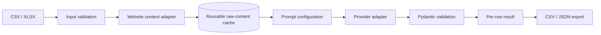

# Architecture

## Design goals

1. Collect content once and evaluate it many times.
2. Keep customer-specific prompts outside application code.
3. Validate model output before accepting it.
4. Isolate failures at row level.
5. Keep tests deterministic and free of paid API calls.
6. Keep credentials out of persisted artifacts and logs.

## Flow

## Failure semantics

- input validation errors are explicit
- unreachable websites become `SCRAPE_ERROR`
- missing cached content becomes `CACHE_MISS`
- provider or validation failures become `EVALUATION_ERROR`
- a failed row never terminates the full batch

## Security

- API keys are read from environment variables
- credentials are never persisted by the pipeline
- demo tests use a deterministic mock provider
