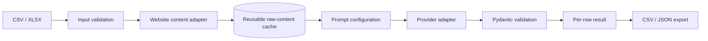

# Architecture

## Design goals

1. Collect content once and evaluate it many times.
2. Keep customer-specific prompts outside application code.
3. Validate model output before accepting it.
4. Isolate failures at row level.
5. Keep tests deterministic and free of paid API calls.
6. Keep credentials out of persisted artifacts and logs.

## Flow

## Failure semantics

- input validation errors are explicit
- unreachable websites become `SCRAPE_ERROR`
- missing cached content becomes `CACHE_MISS`
- provider or validation failures become `EVALUATION_ERROR`
- a failed row never terminates the full batch

## Security

- API keys are read from environment variables
- credentials are never persisted by the pipeline
- demo tests use a deterministic mock provider

## Web Demo V1

The FastAPI app delegates to `portfolio.run_demo`, which loads eight packaged
fictional company fixtures, supplies seven cached pages through an in-memory
`ContentStore`, and calls the same `run_pipeline` as the CLI. The eighth page is
absent, producing the existing `CACHE_MISS` state without an invented exception.
No web path constructs a fetcher or live provider, even in local mode.

Templates, static files and fixtures are installed as package data. Paths derive
from the package location. Requests are independent; no upload, result or cache
files are written. The response carries calculated summary values, complete rows,
metadata and exports derived from those rows. Browser downloads use these exact
export strings. The runtime measures fixture loading through export construction.

The default is `APP_MODE=portfolio`. Local live operations remain in the CLI and
require separate explicit fetch/provider flags. Provider models come from the
CLI option or provider-specific environment setting, with no fallback. Both the
HTTP boundary and pipeline suppress raw exception details to avoid leaking
credentials or SDK internals. This intentionally trades diagnostic detail for a
safe public result surface.
